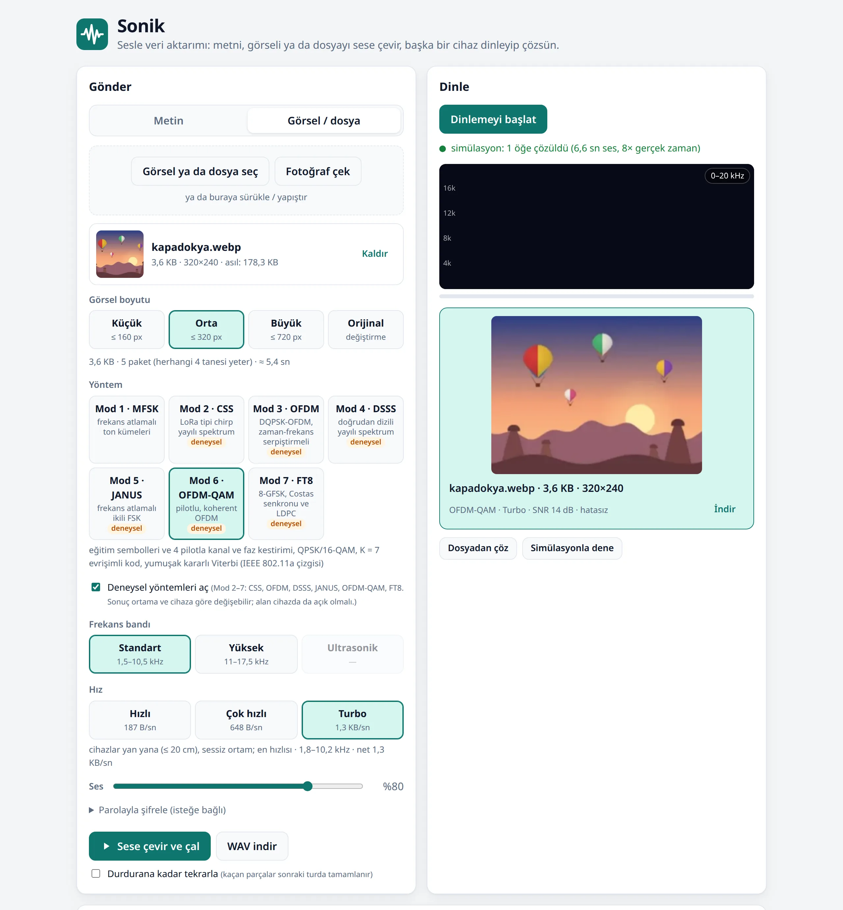

# Sonik: sesle veri aktarımı

Tarayıcıda çalışan, bağımlılıksız bir **akustik modem**. Bir cihaz metni, görseli ya da dosyayı
sese çevirip çalar, diğeri mikrofonla dinleyip çözer. Kurulum, sunucu ya da hesap yok: ses de
içerik de hiçbir yere gönderilmez, her şey tarayıcıda işlenir.

**Canlı sürüm:** <https://sonik.perinet.org>



## Özellikler

- **12 profil:** 3 frekans bandı (Standart 2–10 kHz, Yüksek 11–17 kHz, Ultrasonik 17–20 kHz)
  × 5 hız kademesi (Sağlam, Normal, Hızlı, Çok hızlı, Turbo); 5 B/sn'den 487 B/sn'ye.
- **Metin, görsel ve dosya:** görsel seçilen boyuta küçültülüp WebP olarak yeniden kodlanır; her
  tür dosya gönderilebilir (yayın en çok 5 dakika: Turbo ile ~80 KB). Uzun metin kendiliğinden parçalanır.
- **Sağlamlık:** Reed-Solomon hata düzeltme ve silinti çözme, CRC-32 denetimi, paketler arası
  eşlik parçaları. Tekrar kipinde alıcı kaçırdığı parçaları sonraki turda tamamlar.
- **Otomatik uyum:** profil paket başındaki chirp ve başlıktan tanınır; 44,1/48 kHz farkı, saat
  kayması ve oda yankısı hesaba katılır.
- **İsteğe bağlı şifreleme:** PBKDF2-SHA256 → AES-256-GCM.
- **Araçlar:** canlı spektrogram, WAV indirme, ses kaydından çözme, tarayıcı içinde oda simülasyonu,
  komut satırı kodlayıcı/çözücü.
- **Bağımlılık yok:** saf JavaScript (ES modülleri), derleme adımı yok. Arayüz Türkçe.

## Kullanım

1. Alıcı cihazda sayfayı açıp **Dinlemeyi başlat**'a bas (mikrofon izni istenir).
2. Gönderen cihazda metni yaz ya da **Görsel / dosya** sekmesinden bir dosya seç (sürükle-bırak ve
   yapıştırma da olur; telefonda doğrudan fotoğraf çekilebilir).
3. **Frekans bandı** ve **Hız** seç, **Sese çevir ve çal**'a bas. Alıcı profili kendisi tanır.

İpuçları:

- Ses seviyesi %50–90 arası iyi; hoparlörü sonuna kadar açmak bozulmaya yol açabilir.
- Turbo için cihazları yan yana koy; uzaklaştıkça hızı düşür. Yüksek ve ultrasonik bantlarda
  hoparlörü alıcının mikrofonuna çevir.
- Bluetooth hoparlör/kulaklık sesi sıkıştırıp tonları bozabilir. iPhone'da sessiz mod anahtarı sesi
  kapatabilir. macOS'ta Denetim Merkezi → Mikrofon Modu **Standart** olmalı ("Ses Yalıtımı" tonları siler).
- Telefonda dinlerken ekranı açık, sayfayı önde tut; arka planda tarayıcı mikrofonu durdurabilir.
- Mikrofon için sayfa HTTPS üzerinden (ya da `localhost`'tan) açılmalı.

## Profiller

Ham hız, hata düzeltme ve paket başı yükü hariçtir (bayt/sn).

| Bant | Sağlam | Normal | Hızlı | Çok hızlı | Turbo |
|---|---:|---:|---:|---:|---:|
| **Standart** (1,5–10 kHz) | 5 | 16,7 | 34,5 | 188 | 487 |
| **Yüksek** (11–17 kHz) | — | 16,7 | 25,9 | 75 | 338 |
| **Ultrasonik** (17–20,5 kHz) | — | 8,8 | 17,5 | — | 263 |

| Hız | Kipleme | Ne zaman |
|---|---|---|
| Sağlam | MFSK, 1 kanal | uzak mesafe, gürültülü ve çok yankılı ortam |
| Normal | MFSK, 1–2 kanal | 1–3 m, yankılı oda |
| Hızlı | MFSK, 2–4 kanal | ≤ 1 m |
| Çok hızlı | OFDM, 6–8 blok | oda içinde ≤ 1 m; görsel ve dosya için |
| Turbo | OFDM, 2–3 blok | cihazlar yakın (≤ 50 cm; ultrasonikte yan yana) |

Görsel gönderme süreleri (WebP; parça ve eşlik payı dahil):

| Görsel boyutu | Turbo | Çok hızlı | Yüksek · Turbo | Ultrasonik · Turbo | Hızlı |
|---|---:|---:|---:|---:|---:|
| Küçük (160 px, ≈ 2,5 KB) | 10 sn | 27 sn | 14 sn | 19 sn | 2 dk 11 sn |
| Orta (320 px, ≈ 7 KB) | 28 sn | 69 sn | 39 sn | 51 sn | — |
| Büyük (720 px, ≈ 20 KB) | 74 sn | 3 dk 14 sn | 1 dk 48 sn | 2 dk 23 sn | — |

Kanal simülatöründe paket başarı oranı (%, standart bant, hücre başına 6 deneme; `npm run bench`):

| Koşul | Sağlam | Normal | Hızlı | Çok hızlı | Turbo |
|---|---:|---:|---:|---:|---:|
| yan yana (RT60 0,4 s, DRR +15 dB) | 100 | 100 | 100 | 100 | 100 |
| 50 cm (RT60 0,5 s, DRR +6 dB) | 100 | 100 | 100 | 100 | 100 |
| oda, ~1 m (RT60 0,5 s, DRR 0 dB) | 100 | 100 | 100 | 100 | 0 |
| uzak (RT60 0,6 s, DRR −5 dB) | 100 | 100 | 100 | 0 | 0 |
| yankılı salon (RT60 1 s, DRR −8 dB) | 100 | 100 | 0 | 0 | 0 |
| gürültü, SNR 0 dB | 100 | 100 | 100 | 67 | 0 |
| konuşma girişimi, 0 dB | 100 | 100 | 100 | 100 | 0 |

OFDM'in hızı, oda yankısına karşı hassasiyetle ödenir: uzakta MFSK profillerine dönülmeli.

## Nasıl çalışır

```
│ chirp │ boşluk │ başlık (uzunluk, tür, profil) │ veri + CRC-32 │ RS parite │
  senkron          ← MFSK tonları ya da OFDM alt taşıyıcıları →
```

- **Senkron:** her paket bir chirp (frekans süpürmesi) ile başlar. Alıcı gelen sesi FFT tabanlı
  normalize korelasyonla şablonlara benzetip paket başını milisaniyenin altında bulur. Aynı bantta
  benzer profiller bir chirp'i paylaşır (dinlerken işlemci yükünün çoğu bu korelasyondan gelir);
  hangi profil olduğu başlıktaki profil numarasından anlaşılır.
- **Başlık:** 16 bit uzunluk, 4 bit profil no, şifreli ve tür bayrakları, 4 bayt Reed-Solomon.
  Sürüm, profil ve uzunluk sınırı sahte senkronları eler.
- **MFSK (Sağlam, Normal, Hızlı):** her 4 bit 16 frekanstan biri olarak çalınır, aynı anda 1–4 ton.
  Ardışık semboller dönüşümlü ton kümeleri kullanır; bir kümenin yeniden duyulmasına kadar geçen süre
  ("yankı yaşı") oda yankısına karşı belirleyicidir. Çözme: Hann pencereli Goertzel.
- **OFDM (Çok hızlı, Turbo):** 100 Hz aralıklı alt taşıyıcılar, sembol 10 ms + 3,3 ms koruma.
  Her taşıyıcı bir önceki kullanımına göre faz farkıyla 2 bit (DQPSK) ya da 1 bit (DBPSK) taşır;
  hoparlörün, mikrofonun ve odanın etkisi farkta düşer, kanal kestirimi gerekmez.
  Oda yankısı koruma aralığından çok uzun sürdüğü için taşıyıcılar bloklara bölünür ve her sembolde
  tek blok çalar: bir blok, eski yankısı sönünce yeniden kullanılır (MFSK'deki ton kümelerinin
  karşılığı; Çok hızlı'yı 1 m'lik odada çalışır kılan bu). Seste taşıyıcı osilatörü olmadığından saat
  farkı ve cihaz hareketi yalnız zamanı kaydırır; bu, fazda frekansla orantılı bir eğim olarak ölçülür
  (verinin M. kuvvetiyle modülasyon silinir, sıfırdan geçen doğruya en küçük kareler) ve her sembolde
  düzeltilir.
- **Hata düzeltme:** GF(256) Reed-Solomon. Çözücü her sembolün ne kadar net olduğunu ölçer; şüpheli
  baytlar silinti olarak verilir (2·hata + silinti ≤ parite). CRC-32 tutmayan veri asla gösterilmez.
- **Görsel ve dosya:** içerik K parçaya bölünür, sütun sütun Reed-Solomon ile M eşlik parçası üretilir:
  alıcı herhangi K farklı parçayı duyunca içeriği kurar. Parça boyu, paket başı yük ile dolgu arasında
  yayın süresini en aza indirecek şekilde seçilir.
- **Güvenlik:** alınan metin DOM'a yalnız `textContent` ile yazılır. Görsel, gönderenin bildirdiği
  türe bakılmadan imzasından tanınıyorsa (PNG, JPEG, GIF, WebP) ve boyutu makulse gösterilir; diğer
  her şey yalnız indirilir, dosya adı temizlenir. Sayfa sıkı bir CSP ile sunulur. Ses bir yayındır:
  yakındaki herkes çözebilir, gizli içerik için parola kullan.

## Geliştirme

Gereken: Node.js ≥ 20. Paket kurulumu yok.

```sh
git clone https://github.com/elestirmen/sonic.git && cd sonic
npm test                 # birim + uçtan uca testler (Node, tarayıcısız)
npm run bench            # kanal koşullarına göre başarı oranı tablosu (--profile, --trials, --bytes)
npm run serve            # http://localhost:8000 (localhost güvenli bağlamdır, mikrofon çalışır)
```

Komut satırı:

```sh
node tools/encode.js "mesaj" cikti.wav --profil hizli [--parola …] [--hiz 48000]
node tools/encode.js --dosya foto.webp cikti.wav --profil turbo
node tools/decode.js kayit.wav [--parola …] [--cikti klasör]
```

Kanal simülatörü (`public/src/dsp/channel.js`) hoparlör/mikrofon tepkisi, oda yankısı (RT60, DRR),
44,1↔48 kHz farkı, saat kayması, gürültü ve konuşma girişimini taklit eder; testler, `bench` ve
arayüzdeki "Simülasyonla dene" onu kullanır.

## Proje yapısı

```
public/                  yalnız bu klasör yayınlanır
  index.html, style.css
  src/main.js            arayüz
  src/profiles.js        tüm modem parametreleri (bantlar, hızlar, OFDM düzeni)
  src/modem.js           verici: bayt → paket → dalga formu (tek ya da çok paket)
  src/receiver.js        alıcı: senkron adayları → paket çözücüler
  src/receiver-worker.js kodlama ve çözme işi (Web Worker)
  src/mod/               mfsk.js, ofdm.js (verici + alıcı)
  src/transfer.js        görsel/dosya: parçalama, paketler arası RS, birleştirme
  src/image.js           görsel küçültme; alınan görselin imzası ve boyutu
  src/crypto.js          PBKDF2 + AES-GCM
  src/codec/             crc32, reedsolomon, framing
  src/dsp/               fft, filters, chirp, sync, store, channel
  src/audio/             capture-worklet (AudioWorklet), wav
  src/ui/spectrogram.js
test/                    node --test; bench.js
tools/                   encode, decode, deploy
docs/                    README görseli
docker-compose.yml, nginx.conf
```

## Yayınlama

`public/` klasörü herhangi bir statik sunucuyla yayınlanabilir; mikrofon için HTTPS gerekir.
Depodaki yapılandırma bir `nginx:alpine` konteyneri (`sonik-web`) kullanır; `nginx.conf` önbelleği
ETag ile doğrular ve sıkı bir CSP uygular:

```sh
docker compose up -d
```

`tools/deploy.mjs`, canlı sürümün kurulumuna (Cloudflare DNS + Nginx Proxy Manager + Let's Encrypt)
özgüdür; kimlik bilgilerini ortam değişkenlerinden ya da `--env` dosyasından okur, hiçbirini yazdırmaz.
Başka bir kurulumda `DOMAIN`, `REFERENCE` ve betikteki `UPSTREAM` değiştirilmeli.

## Sınırlar

- OFDM profillerinde yankı arttıkça hata artar; Turbo yakın mesafe, Çok hızlı oda içi içindir.
- Yüksek ve ultrasonik bantların başarısı hoparlör ve mikrofona bağlıdır; bazı telefonlar 17 kHz
  üstünü zayıf çalar ya da kaydeder.
- Tarayıcı ya da işletim sistemi mikrofon sesini işlemeyi (yankı engelleme, gürültü bastırma)
  kapatmazsa tonlar bozulabilir; sayfa bunu algılayınca uyarır.
- Paket biçiminin 2. sürümü, ilk sürümle (tek baytlık uzunluk, 4 profil) uyumlu değildir.

## In English

Sonik is a dependency-free acoustic modem that runs in the browser: one device turns text, an image
or a file into sound, another decodes it from the microphone. It offers 12 profiles across three bands
(2–10 kHz, 11–17 kHz, near-ultrasonic 17–20 kHz). The slower profiles use echo-tolerant MFSK. The
faster ones use differential-PSK OFDM with block hopping and reach up to 487 B/s at close range.
Reed-Solomon with erasures, a CRC-32 and cross-packet parity chunks make image and file transfer
tolerant to lost packets. Optional AES-GCM encryption is available. Everything stays on the device.
The UI is in Turkish. Try it at <https://sonik.perinet.org>.
